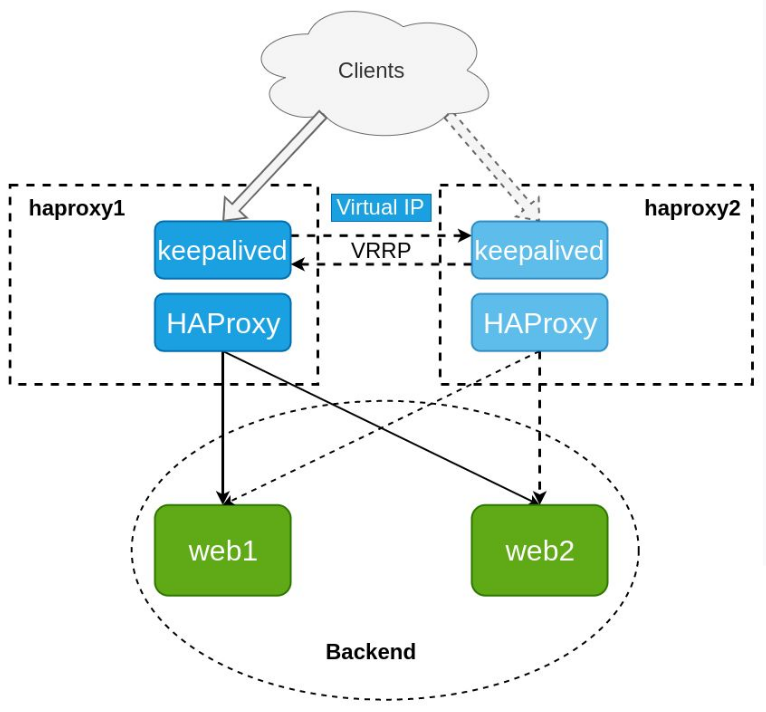
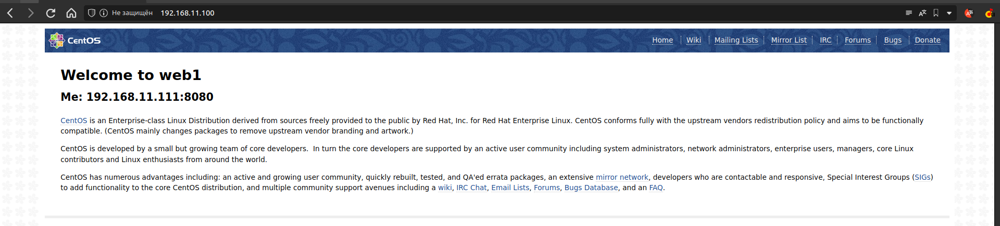
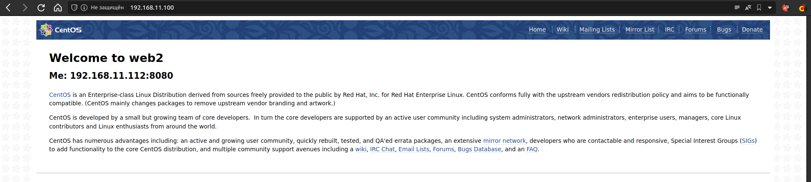

<h1> Лабораторная №5 </h1>
Задание:
<ul>
<li>На серверах web1, web2 установить Nginx.</li>
<li>На серверах haproxy1, haproxy2 установить и настроить  отказоустойчивую связку HAProxy+Keepalived. Настроить VIP с помощью Keepalived в соответствии со схемой</li>
<li>На серверах web1, web2 Nginx должен работать по порту 8080 и отдавать кастомную страницу, зайдя на которую можно понять на каком сервере вы находитесь.</li>
<li>На серверах с HAProxy ПО должно обеспечить балансировку нагрузки серверов web1 и web2 в режиме round-robin. Сделать таймауты ожидания ответа web1 и web2 как можно меньше. Скажем, 1-2 секунды</li>
<li>Установка и настройка всего ПО должна быть обеспечена Ansible-сценарием.</li>
<li>Все файлы по этому заданию выложить в Github и написать ReadMe со скринами работоспособности и инструкцию по запуску вашего Ansible-сценария.</li>
</ul>

Схема:



В шаблонном обзазе Centos отключены selinux и firewall
Клонируем репозиторий и переходим в директорию lab5/ansible

```bash
# Затем создаем виртуальные машины:
$ vagrant up

# И выполняем всю необходимую конфигурацию
$ ansible-playbook base.yml
```

<b  style="font-size: 20px">Все машины запущены: </b>


Проверим:



Затем мы можем вывести из строя как webserver так и haproxy, а может их вместе:
 

И все будет прекрасно работать:



Опыт приходит с опытом