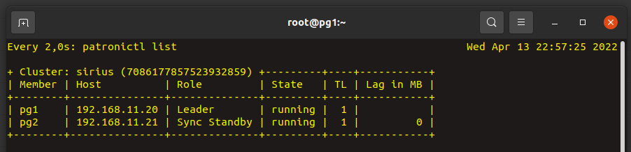

# Лабораторная работа №7

Шо надо
---------------------------
1. Настроить консул (использовать уже готовую роль и инветори).
2. База данных должна быть проинициализирована на выделенных дисках (в Vargrantfile они уже подключены). БД должна находить в папке /pgsql/pg_data/14. WAL архивы должны находить в папке /pgsql/pg_wal/14. В эти папки должны быть примонтированы диски /dev/sdb и /dev/sdc соответственно. Диски должны быть подключены в LVM и отформатированы в файловой системе xfs.
3. На серверах pg1 и pg2 настроить оркестратор репликации Patroni (пакет в архиве).
4. С помощью утилиты vip-manager обеспечить настройку VIP адреса на мастер сервере. https://github.com/cybertec-postgresql/vip-manager/releases/download/v1.0.2/vip-manager-1.0.2-1.x86_64.rpm . Напоминаю, что в конфиге vip-manager необходимо настроить подключение по DCS Consul. IP адрес подключения 127.0.0.1:8500. Так же нужно будет указать consul_token, переменную которого можно взять в роли consul


Шо мы делаем
-------------------
В папке ansible:
```bash
# Создаем виртуальные машины:
$ vagrant up

# Устанавливаем эту штуку для создания vg и lwm
$ ansible-galaxy collection install community.general

# И выполняем всю необходимую конфигурацию
$ ansible-playbook base.yml
```


Шо получается
-------------------
```bash
# Заходим на любой client, например:
$ ssh root@192.168.11.20

# Смотрим на лидера и не лидера
$ watch patronictl list
```


А теперь наслаждаемся успешной жизнью